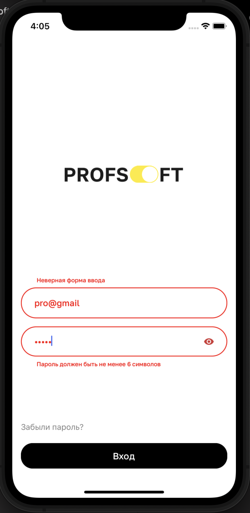
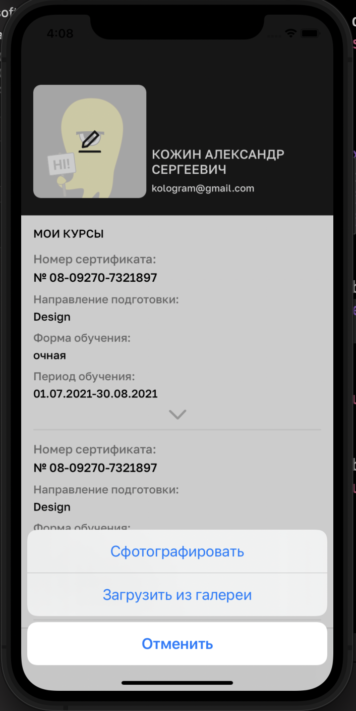

# PROFSOFT TEST APP (UIKit)

### Стартовый экран / Start Screen

. 

### Авторизация пользователя / Login Screen

   

#### Валидация формы входа / Login form validation

   

### Профиль пользователя / Profile Screen

  

#### Возможность изменить фотографию пользователя / Ability to change user photo

  

При запуске приложения появляется SplashScreen с анимацией (появление логотипа компании)
